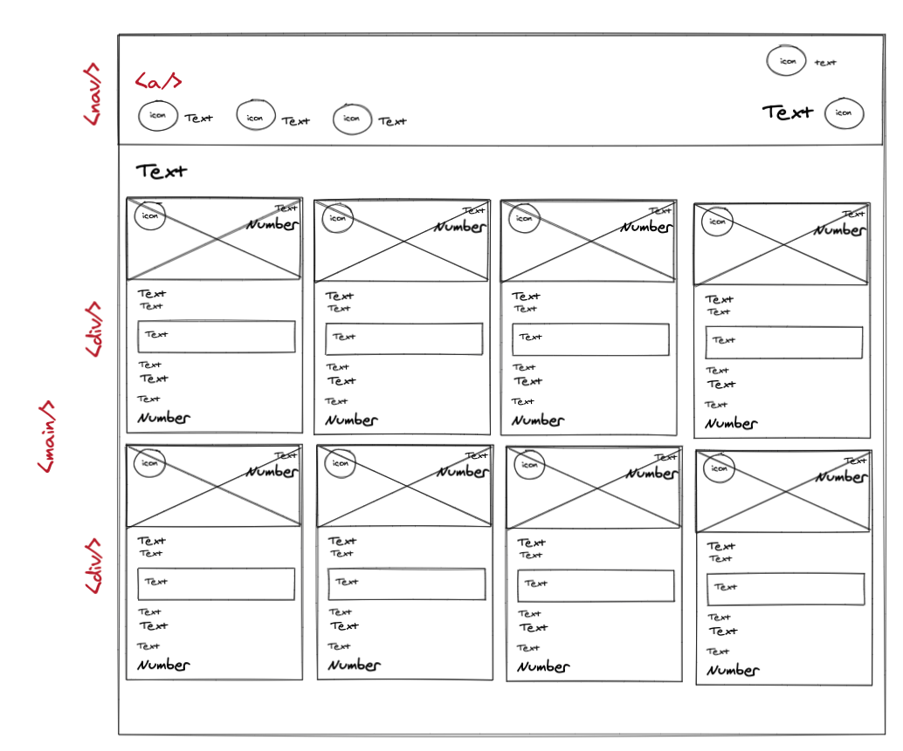

# Static Comp Challenge 1

## Introduction

### Website Create By JP Carey

[My GitHub Repository](https://github.com/jaypeasee?tab=repositories)

[Turing School of Software and Design](https://turing.io/)

This was my second solo project and first project where I created a page from scratch using HTML and CSS.

The prompt was to create a new page based on an original design. The structural specs and elements of the page needed to match the layout of the provided design. That said, I had a creative license for some styles such as images, copy, icons and color palette. See the image of the required layout below.

The goal was also to make this page compatible across different browsers such as Firefox, Safari and Chrome and have smooth transitions into different breakpoints for tablets and smartphones.

## Progression

The projects started with creating a repo on Github and adding directories for the `index.html`, `styles.css`, `normalise.css`, assets, and initializing them with necessary tags and hrefs.

From there, I made a low-fidelity wireframe of the design to help conceptualize the structure and how it might relate to certain HTML tags as well as CSS grid or flexbox strategies. See wireframe below.

I was able to start organizing specific HTML tags, classes, placeholder content, and colours to give the page a rough vertical structure. I first started organizing the cards in the `<section/>` of the page, where the recipes could be found. Then I moved on to the `<nav/>`. Using the CSS grid method, I was able to align `
` s from each section horizontally to closer match the comp.

## Key Concepts and Challenges

## Acknowledgements

- My instructors - Casey DallaValle, Scott Ertmer, and Hannah Hudson for lectures on basic HTML, CSS and wireframing, and the independent lesson plans they provided for Flexbox and Grid displays.
- My mentors - Isaac Chabon, Kristen Cabrera, and David Becker - Who helped with me better understand the concepts of flexbox and grids styling displays in CSS.
- Other members of my cohort at Turing for providing an inclusive but creative atmosphere that allowed for free and open advice.

## Additional Information Conerning the Project
